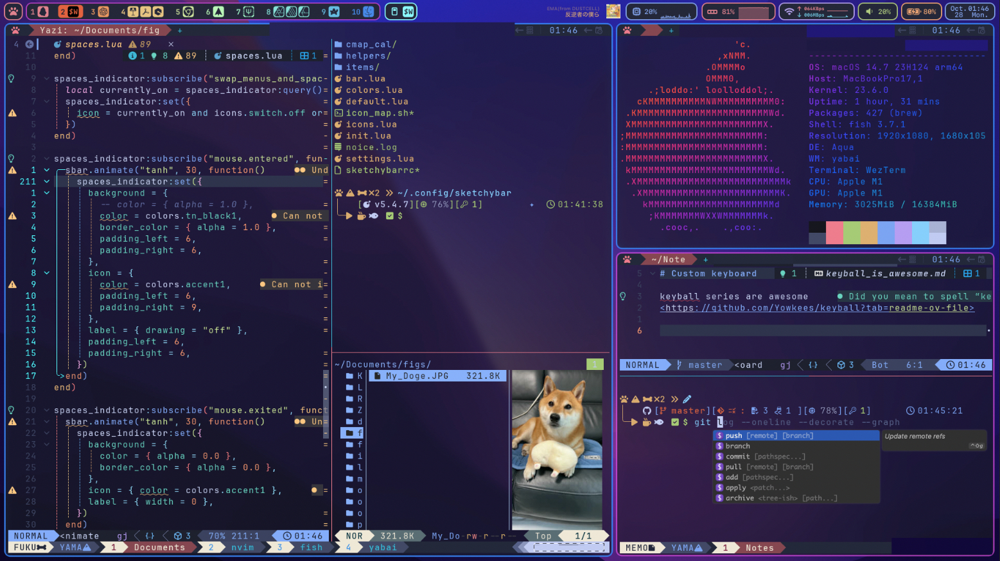

# SoichiroYamane's dotfiles

## 🌃 TokyoNight Theme



## 🍺 Features

- [amazon-q](https://aws.amazon.com/q/developer/)

    ```bash
    brew install amazon-q
    ```

- [bat](https://github.com/sharkdp/bat)

    ```bash
    brew install bat
    ```

- [borders](https://github.com/FelixKratz/JankyBorders)

    ```bash
    brew tap FelixKratz/formulae && brew install borders
    ```

- [lazygit](https://github.com/jesseduffield/lazygit)

    ```bash
    brew install lazygit
    ```

- [neofetch](https://github.com/dylanaraps/neofetch)

    ```bash
    brew install neofetch
    ```

- [sketchybar](https://github.com/FelixKratz/SketchyBar)

    ```bash
    brew tap FelixKratz/formulae && brew install sketchybar
    ```

- [skhd](https://github.com/koekeishiya/skhd)

    ```bash
    brew install koekeishiya/formulae/skhd && brew services start skhd
    ```

- [yabai](https://github.com/koekeishiya/yabai)

    ```bash
    brew install koekeishiya/formulae/yabai && brew services start yabai
    ```

- [yazi](https://github.com/sxyazi/yazi)

    ```bash
    brew install yazi
    ```

## ⚙️ Configuration

### Example: SketchyBar

1. Clone dotfiles from the repository:

    ```bash
    git clone https://github.com/SoichiroYamane/dotfiles.git
    mv ~/.config/sketchybar ~/.config/sketchybar.bak
    cp -r ./dotfiles/sketchybar ~/.config/sketchybar
    ```

2. Install assets for this sketchybar.

    ```bash
    cd ~/.config/sketchybar/helpers
    ./install.sh
    ```

3. Restart sketchybar

    ```bash
    brew services restart sketchybar
    ```

## 🍹 For SketchyBar users

[sketchybar-app-font-bg](https://github.com/SoichiroYamane/sketchybar-app-font-bg) is still in development. If you want to request icons, please feel free to open an issue!

`./sketchybar/icon_updater.sh` is a script to update icons. You can use it to update icons.

## 🗓️ TODO

- [ ] Add wezterm
- [ ] Add tmux
- [ ] Add fish
- [ ] Add neovim
- [ ] Add other small tools
